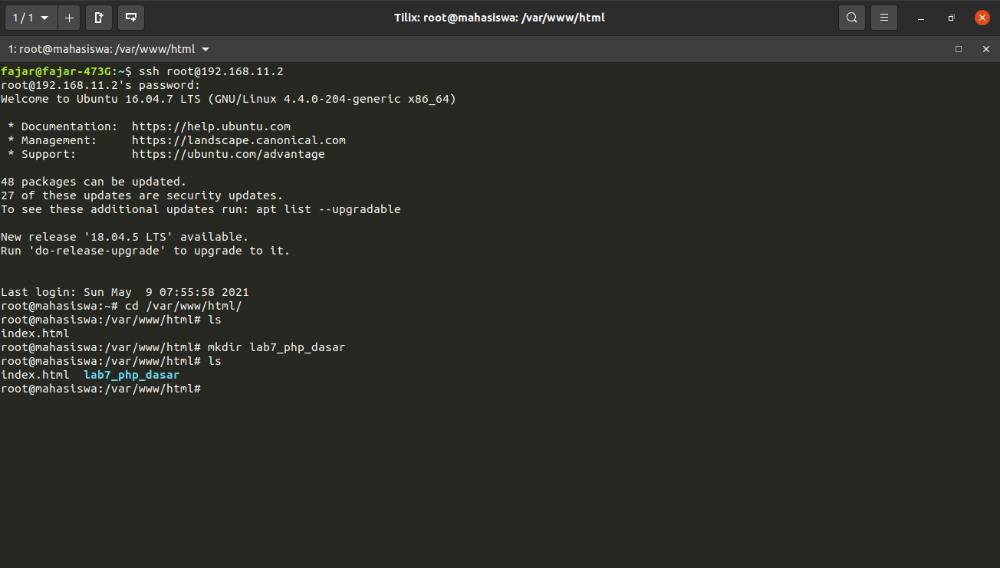
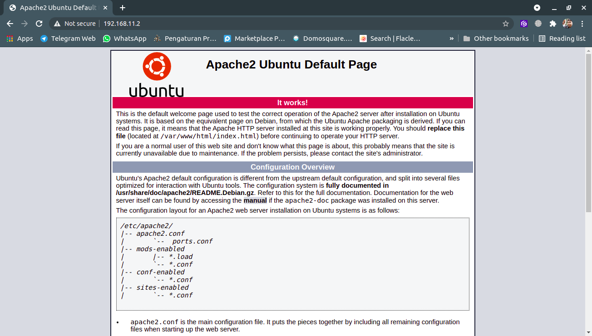
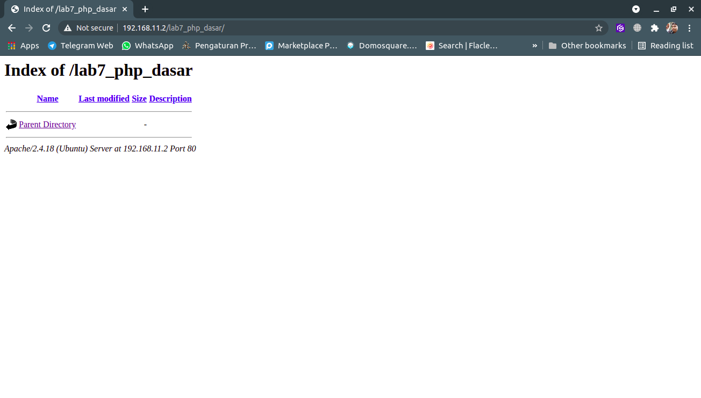
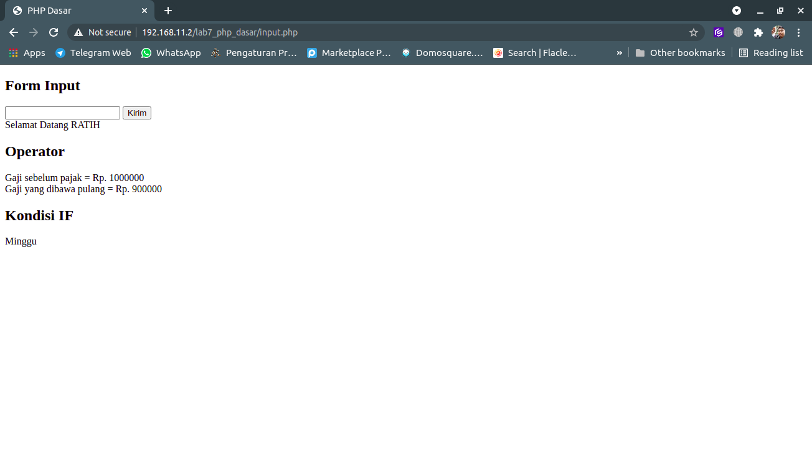

Fajar Arif Riyanto  
311910666  
TI 19 B2

1. Menyiapkan Web Server.     
     

2. Membuat directory baru lab7_php_dasar di directory web server.  
    

3. Memastikan web server sudah berjalan.    
    

4. Membuka directory yang sudah di buat di web server sebelumnya.  
     

5. Mambuat File PHP Dasar.  
      
    <!--  -->

6. Contoh variabel pada php.  
      
    <!--   -->

7. Membuat Form Input dengan php.  
      
    <!--    
        -->

8. Operator Pada PHP.  
    

9. Kondisi IF, Kondisi Switch, Perulangan FOR, Perulangan While, dan Perulangan DOWHILE.
      
      
      
      
      

   
TUGAS
1. Membuat form input yang menampilkan nama, tanggal lahir dan pekerjaan. Kemudian tampilkan outputnya dengan menghitung umur berdasarkan inputan tanggal lahir.

     

